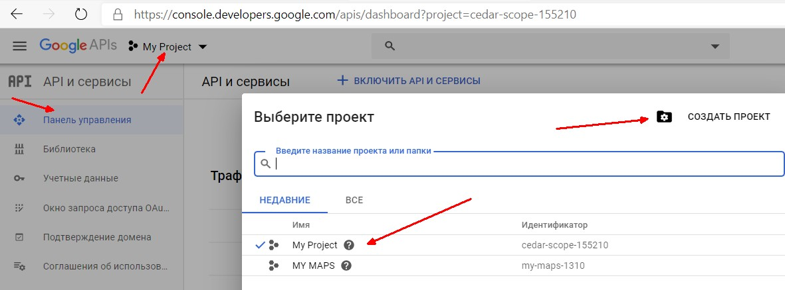
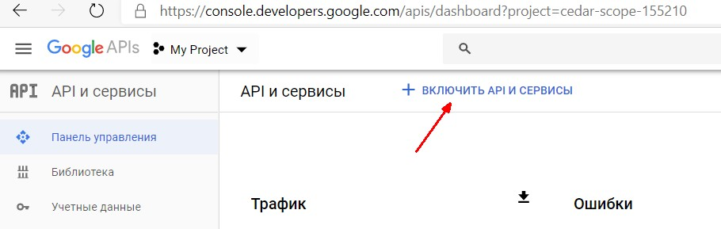
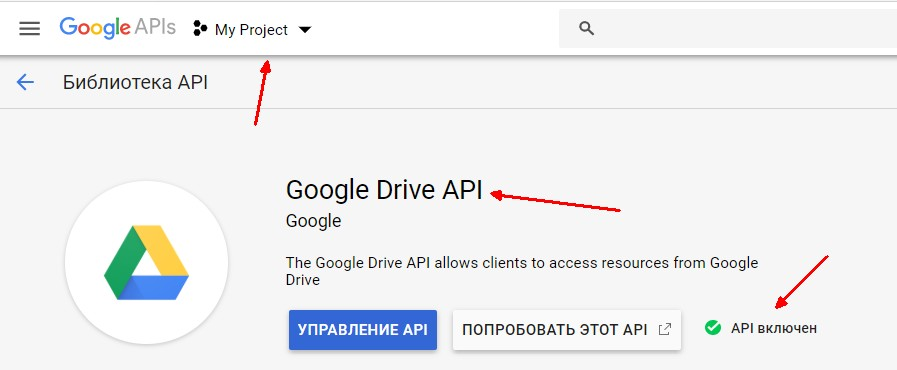
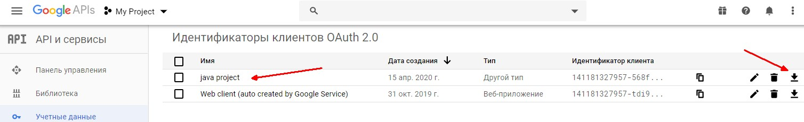
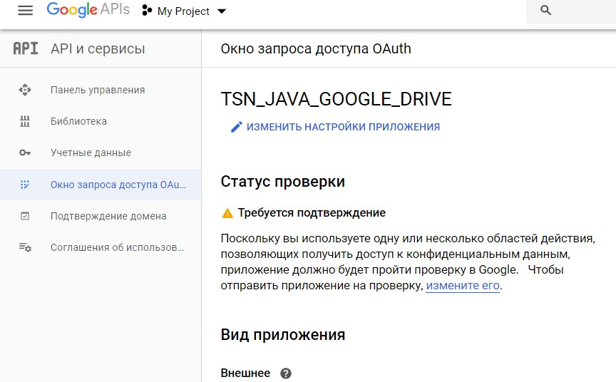
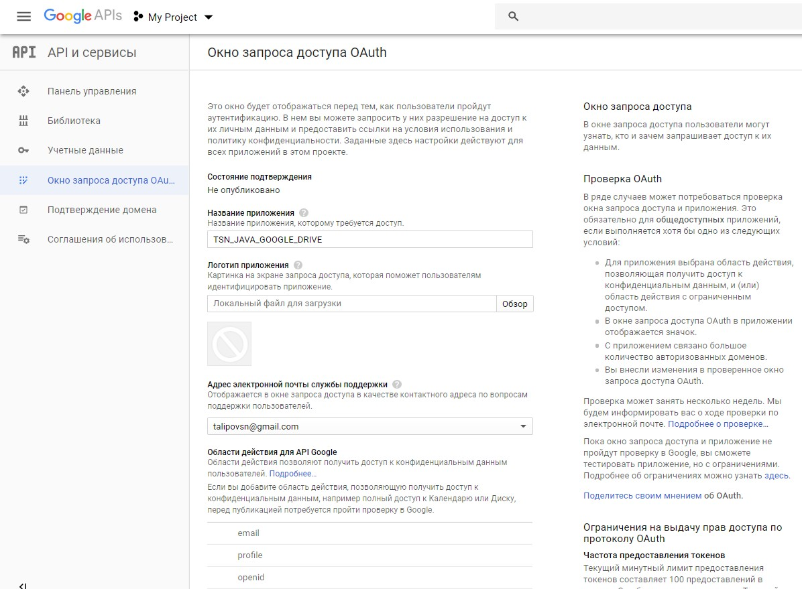
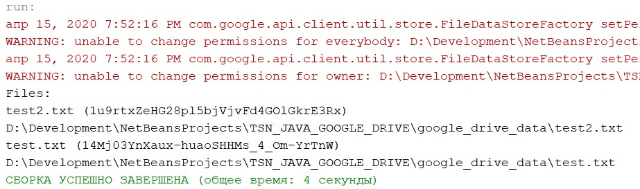

# TSN_JAVA_GOOGLE_DRIVE

Прмер работы с облаком Google Drive (API v.3)

https://console.developers.google.com/apis/credentials

https://developers.google.com/drive/api/v3/reference/query-ref

https://developers.google.com/drive/api/v3/manage-downloads

https://developers.google.com/drive/api/v3/ref-export-formats

https://developers.google.com/drive/api/v3/appdata

https://developers.google.com/drive/api/v3/search-files

https://developers.google.com/drive/api/v3/reference/files/list

